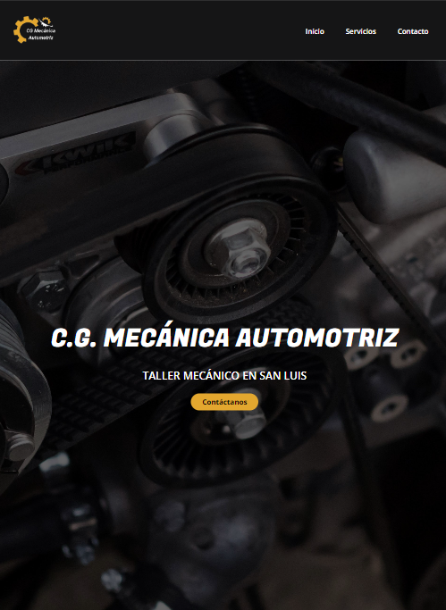
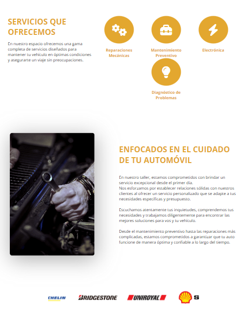
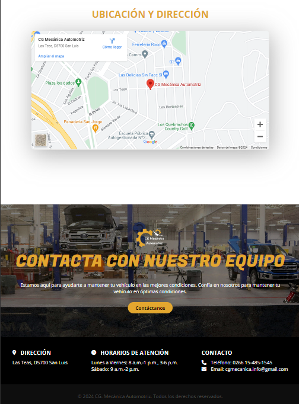

# C.G. Mecánica Automotriz

This is a web page project for an automotive workshop. The page is designed to provide information about the services offered, contact information, and details about the workshop.

## Features

- **Home Page**: Presents a brief description of the workshop and a contact button.
- **Services**: Details about the services offered by the workshop.
- **About Us**: Information about the workshop's philosophy and commitment.
- **Brand Slider**: Displays a selection of product brands available.
- **Location and Address**: Interactive map with the workshop's location.
- **Contact**: Contact form for users interested in reaching out to the workshop.
- **Footer**: Contact information and business hours.

## Technologies Used

- HTML
- CSS
- JavaScript
- EmailJS for sending emails from the contact form.

## Installation

No installation is required. Simply open the `index.html` file in any compatible web browser.

## Usage

1. Navigate through the different sections using the navigation menu.
2. You can click on the "Contact Us" button to open a contact form.
3. Fill out the contact form with your name, email, subject, and message.
4. Click "Send" to submit the message. You will receive a confirmation notification once the message has been sent.

## Author

This project was developed by [JaGo-1](https://github.com/JaGo-1).
